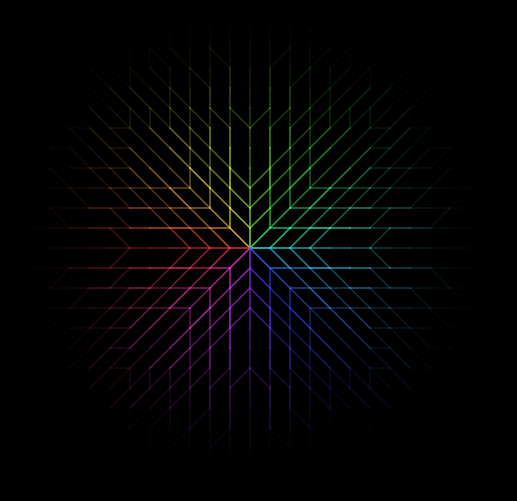
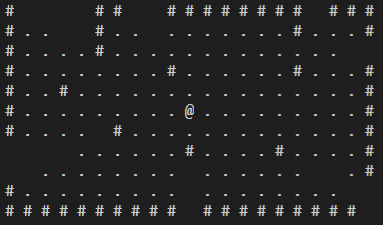
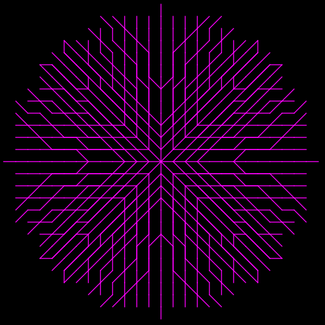
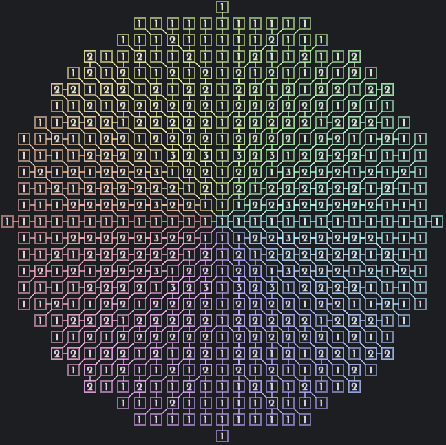
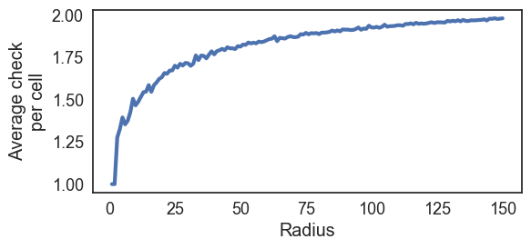

# Symmetric Pre-Computed Visibility Trie + Fast LOS

This is my implementation of
[Pre-Computed Visibility Tries](http://www.roguebasin.com/index.php?title=Pre-Computed_Visibility_Tries) (PCVT)
with two improvements over the other descriptions on the web:

* The resulting Field of View (FOV) is symmetric (it means that a point A sees B if and only if B sees A);
* Line of Sight (LOS) with roughly the same time efficiency of one Bresenham's Line call,
  but that keeps the exact same visibility behavior as the full FOV.

Currently, there are implementations for:

* C++14
* Lua (luajit)

I may implement the algorithm in more languages if there are demand. One such a possibility is a C wrapper for the C++ implementation, so that it can be used with FFI.

## How to use it?

Documentation is provided in `C++/SPCVT.h`. The Lua implementation follows the exact same interface. Examples are provided for both languages.

Only once, create one instance of SPCVT choosing the desired maximum radius. From there, you call FOV or LOS according to what you need.

FOV asks for an origin point (for instance, the player's position to check what they can see), a callback function that answers if a given
position blocks line of sight and a callback function that is used to set the inform which floor tiles are visible. The former function can be used to set the visibility instead of the second, to directly set the visibility of visible wall tiles as well. See `C++/SPCVT.h` for more information and the figure below for an example.

LOS asks for two points and answers if they can see each other. It also asks for a callback function that answers if a given position blocks line of sight. One final optional parameter is a callback function that is called for each point within the line of sight. See `C++/SPCVT.h` for more information.

## Cautions in the use

* The constructor of SPCVT is a bit heavy on computation. Do not create an instace every time you want to compute FOV. Instead, create one instance just once and reuse it for each FOV computation.

* *The algorithm is only symmetric if just one radius is used for all FOV and LOS computations!* If you need characteres with varying radius of sight, create one instance of SPCVT with the biggest radius and limit FOV/LOS of characters that have lower radius through your personalized callback functions (the ones that check whether a cell is visible), filtering out cells that are out of reach.

* FOV will call the DoesBlockVision callback with positions that do not exist / are out of the bounds of your world grid. The callback must treat those cases. The SetVisibility callback should always be called with valid positions, though.

* Similarly, LOS can potentially call DoesBlockVision with invalid positions, although this would happen only if there are invalid positions between the two points given to LOS. This case should not happen if the map is represented as a rectangular grid and only points within this grid are passed to LOS.

## Why?

There are three points of why.

When I discovered PCVT on the web, I also realized that there is a lot of confusion about how it works, why one should use it, and what are its advantages, despite the altorighm being incredibly simple compared with most of the other approaches on the web.
As I liked the method for its simplicity, I wanted to come up with a clean and accessible implementation for other people to use it.

Finally, I added two improvements that makes PCVT competitive in certain use cases, as I explain next.

Symmetry is one of the most desirable traits for FOV algorithms, as people usually don't like to be hit by a monster that cannot be seen.
Fast LOS is another very useful thing to have, as it is usually not necessary to compute the full FOV of non-player characteres (NPC), like monsters. 
Instead, one could want to just check which itens, from a small list, a NPC can see.
(note: since the algorithm is symmetric, computing the FOV for the player already reveals which monsters see the player as well).

One common problem is that most FOV algorithms do not provide a straight way of computing the LOS between two points without computing the full FOV for either point. To avoid additional time cost, one may use Bresenham's Line to perform a raycast. However, the visibility behavior would differ from the one obtained by computing the FOV. Furthermore, Bresenham's algorithm itself is assymetric (although this fact is easily mitigated by using the less known TranThong algorithm).

In this implementation, the `LOS(a, b)` is true if and only if `b` is in the `FOV(a)` and if and only if `a` is in the `FOV(b)`. However, computing LOS is roughly `O(ED(a,b))`, while computing FOV is roughly `O(π*r*r)`, where `ED` is the euclidean distance and `r` is the maximum radius for the FOV. 

An illustration of the symmetry is shown in the next figure.

I note that the cost of computing the full FOV with PCVT is also very competitive with other approaches. There is barely any calculation for each cell in the grid, since the algorithm is simply a traversal in a pre-computed trie. The following figure details the number of times each cell is visited when the radius is 13.

The following figure presents the average number of times each cell is visited for different radii, from one to 150 with increments of one. The source data for this plot is available in `images/data.csv` and the code in `C++/genPlot.cc`.

## Possible improvements

### C++

Apparently, std::function is slow-ish. There are [alternatives](https://codereview.stackexchange.com/questions/14730/impossibly-fast-delegate-in-c11) that keep the same behavior (although there are comments about corner cases where it is way slower than std::function). Anyway, I preferred to keep this solution to make the code easier to use.

### Lua

Closures _can_ be slow (particularly if you are using Luajit 2.0.5 or prior rather than the newer 2.1 beta3) if you modify the captured values. In such cases, consider passing a callable table.
(ps: yes, this is the type of closure used in `AddPath`, however this is only used during the construction of the SPCVT).
