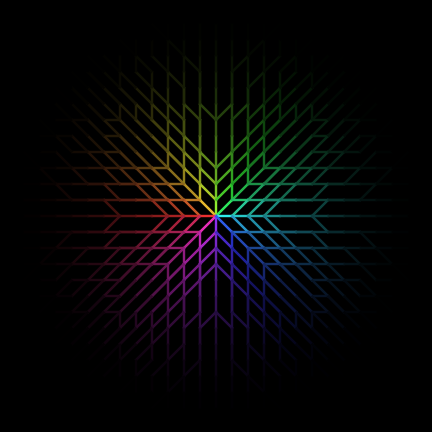

# Really Symmetric Pre-Computed Visibility Trie (RSPCVT) + Fast LOS



## A Note on Symmetry and Revision (January 2026)

Years after publishing the original SPCVT, I realized, thanks to rigorous testing and feedback from [Vivificient](https://www.reddit.com/user/Vivificient), that the original algorithm was not truly symmetric. While the rays themselves were symmetric, the "permissive" nature of the trie allowed for incidental visibility that didn't always hold up when the origin and target were swapped.

I have now completely rewritten the core logic to address this. The original, "more permissive" (but asymmetric) code has been moved to the `DEPRECATED-wrong-algorithm` folder. It remains there as a reference for the original SPCVT, as it still holds certain merits common to other PCVT implementations: it is faster to compute and significantly more memory-efficient, even if it does not strictly adhere to symmetry. 

The new **RSPCVT** (Really Symmetric Pre-Computed Visibility Trie) in the root directory is the recommended version for games where vision symmetry is a mechanical requirement.

### The Fix: From Permissive to Strict
The original problem stemmed from how a tree of Bresenham-like rays handles incidental visibility. In the previous version, point A could see B simply because the specific ray targeting point C happened to pass through B.

This creates a symmetry break: while a single TranThong ray is perfectly symmetric when comparing the path between exactly two points (A to B vs. B to A), the set of rays originating from A is entirely different from the set of rays originating from B. Consequently, a ray starting at B might never pass through A on its way to its own targets, leaving A invisible to B even though B is visible to A.

The new **RSPCVT** (Really Symmetric Pre-Computed Visibility Trie) fixes this by enforcing a strict rule: **Point B is visible from A if and only if the specific pre-computed ray $TT(A, B)$ is unobstructed.** No other ray is allowed to grant "incidental" visibility to that cell.

**The Drawback:**
This new version is much stricter. In the previous version, you might see a tile "around a corner" because a neighboring ray touched it. In RSPCVT, if the single dedicated ray for a tile is blocked, that tile is invisible—even if it seems like a "near miss" from a neighboring ray. This results in a "cleaner" but less permissive field of view.

---

## Empirical Symmetry Stress Test Result

[Code](Lua/sym_stress_test.lua)

```
========================================
   SYMMETRY CONFUSION MATRIX
========================================
 Total Valid Paths: 747870
----------------------------------------
 Both See (A<->B):   71226
 Neither See:        676644
----------------------------------------
 Only A sees B:      0  (FAIL)
 Only B sees A:      0  (FAIL)
----------------------------------------
 Final Result:       PERFECT SYMMETRY
========================================
```

## Benchmark

The output of **RSPCVT** is mathematically equivalent to computing FOV by running a dedicated **Tran-Thong** line-of-sight check for every single cell within the bounding box of the vision radius. 

While the results are identical, RSPCVT is significantly more efficient. It eliminates redundant tile checks near the origin and uses its Trie structure to "prune" entire branches of visibility the moment a blocker is encountered.

Below, we compare RSPCVT against two Naive variants:
1. **Standard Naive:** Uses a non-interruptible Tran-Thong ray. Even after hitting a blocker, the ray continues processing until it reaches the target coordinate.
2. **Interruptible Naive (Fair):** Uses an optimized Tran-Thong ray that exits immediately after the first blocking cell is detected.

### LuaJIT Performance
*Tested with Radius 20 over 50,000 iterations. Average Map Gen: 0.000067s.*

| Algorithm | Total Time (excl. Map Gen) | Avg. Time / FOV | Speedup vs. RSPCVT |
| :--- | :--- | :--- | :--- |
| Naive (Standard) | 14.4841 s | 0.000289 s | 8.05x slower |
| Naive (Interruptible) | 9.7731 s | 0.000195 s | 5.69x slower |
| **RSPCVT** | **1.7171 s** | **0.000034 s** | **—** |

### Python Performance
*Tested with Radius 20 over 10,000 iterations. Average Map Gen: ~0.000130s.*

| Algorithm | Total Time (excl. Map Gen) | Avg. Time / FOV | Speedup vs. RSPCVT |
| :--- | :--- | :--- | :--- |
| Naive (Standard) | 19.3844 s | 0.001938 s | 14.17x slower |
| Naive (Interruptible) | 7.3361 s | 0.000733 s | 5.22x slower |
| **RSPCVT** | **1.3683 s** | **0.000137 s** | **—** |

### Why the Speedup?
* **Zero Redundancy:** In Naive approaches, tiles near the observer are visited by hundreds of overlapping rays. RSPCVT visits each unique relative tile in the trie exactly once.
* **Recursive Pruning:** When RSPCVT hits a wall, it discards all "dependent targets" behind that wall instantly. Even an interruptible Naive approach must still initiate and partially process every individual ray targeting the area behind that wall.
* **Call Overhead:** In high-level languages like Python, reducing function call volume from ~15,000 (Naive) to ~1,250 (RSPCVT) per FOV significantly lowers the execution floor.

### Python

[non-interrruptable baseline](Python/benchmark.py)

```
Benchmarking Python RSPCVT: Radius 20, 10000 iterations
--------------------------------------------------
Avg Map Gen Time:    0.000133 s
Total Naive Time:    19.3844 s (excl. map gen)
Total RSPCVT Time:   1.3683 s (excl. map gen)
--------------------------------------------------
Speedup Factor:      14.17x faster
Avg RSPCVT FOV:      0.000137 s
```

[non-interrruptable baseline](Python/benchmark.py)

```
Benchmarking Python (Fair): Radius 20, 10000 iterations
--------------------------------------------------
Avg Map Gen Time:    0.000127 s
Total Naive Time:    7.3361 s (excl. map gen)
Total RSPCVT Time:   1.4057 s (excl. map gen)
--------------------------------------------------
Speedup Factor:      5.22x faster
Avg RSPCVT FOV:      0.000141 s
```

---

## Features

This is an implementation of [Pre-Computed Visibility Tries](http://www.roguebasin.com/index.php?title=Pre-Computed_Visibility_Tries) (PCVT) with two critical improvements:

* **Strict Symmetry:** Guaranteed FOV symmetry (A sees B $\iff$ B sees A).
* **Fast LOS:** Line of Sight checks with the efficiency of a single raycast, guaranteed to match the FOV behavior exactly.

However, there is a **major drawback**: the visibility is much stricter (less permissive).

Currently, there are implementations for:
* **C++17**
* **Lua (optimized for LuaJIT)**
* **Python 3**

## How to use it?

Documentation is provided within the source files (`C++/RSPCVT.h`, `RSPCVT.lua`, and `RSPCVT.py`). 

1. **Initialize:** Create a single instance of `RSPCVT` with your desired maximum radius. This step is computationally expensive as it builds the Trie; do this only once (e.g., at level load).
2. **FOV:** Pass an origin point, a `DoesBlockVision` callback, and a `SetVisible` callback.
3. **LOS:** Pass two points to check if they have a clear line of sight. This uses the same `TranThong` ray logic as the FOV for perfect consistency.

## Cautions in the use

* **Memory Usage:** Because the new algorithm stores a list of "dependent targets" for every node in the trie to ensure symmetry, it uses significantly more RAM than the deprecated version. For very large radii (e.g., >100), expect high memory overhead.
* **Symmetry and Variable Radii:** RSPCVT guarantees symmetry even between two observers using different `RSPCVT` instances with different radii. As long as both observers are within each other's maximum pre-computed distance, the ray $TT(A, B)$ used by Observer A will be the exact same path (in reverse) as $TT(B, A)$ used by Observer B.
* **Out of Bounds:** Your `DoesBlockVision` callback must be able to handle coordinates that are outside your map boundaries, as the Trie will check all coordinates within the pre-computed square.

## Why RSPCVT?

Symmetry is a "Holy Grail" in roguelike development. It prevents frustrating gameplay situations where a monster can shoot a player who cannot see them in return. 

By using the **TranThong** algorithm (a symmetric version of Bresenham's line), we ensure that the path from $A \to B$ is identical to $B \to A$. By combining this with a Trie that tracks target dependencies, we gain the performance of pre-computation without the common artifacts of shadowcasting or the asymmetries of naive raycasting.

## Implementation notes

### C++
The implementation uses `std::function` for callbacks. While convenient, it can be a bottleneck in extremely tight loops. If performance is critical, consider refactoring the `FOV` method to use a template-based visitor pattern.

### Lua
The Lua implementation is optimized for LuaJIT, using integer keys and a reusable table cache to minimize Garbage Collection (GC) pressure during FOV calls.
